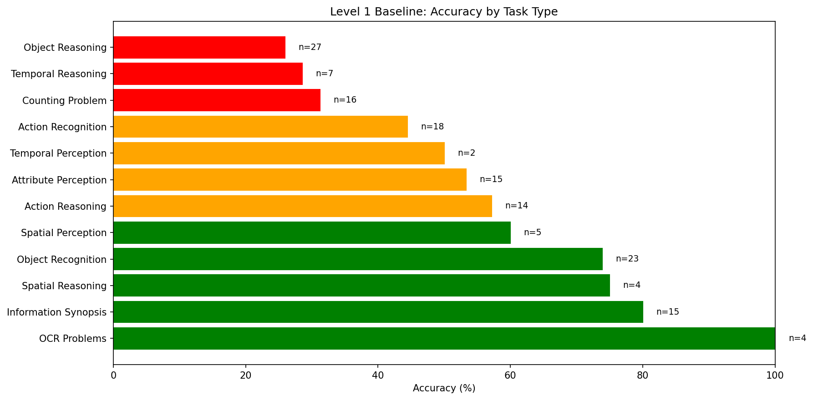
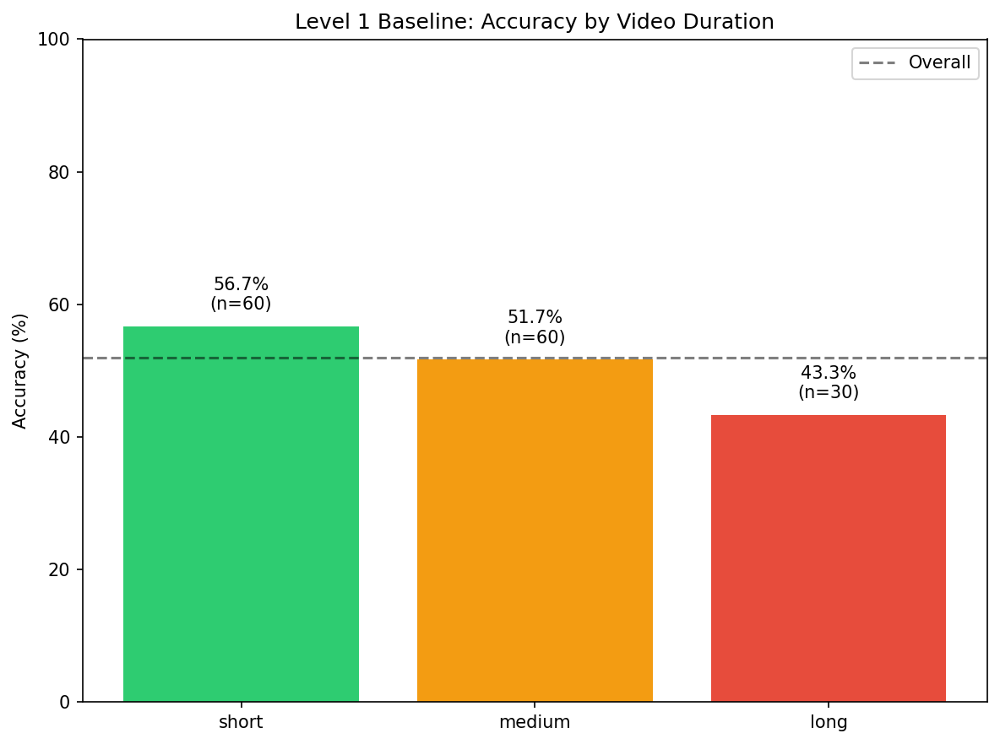

# VLM Context Engineering

Research project investigating how different context management strategies affect vision-language model (VLM) performance on long-video question answering.

## Project Overview

We're building on the AVAS (Agentic Video Analytics System) paper to perform a fine grained evaluation of how improvements in context management impact VLM accuracy, latency, and cost. Starting with a simple vector-RAG baseline, we progressively add: semantic chunking, event knowledge graphs, tri-view retrieval, agentic search, and self-consistency.

**Research Question**: How does the amount and structure of retrieved context change a VLM's accuracy, latency, and cost on video QA?

## Level 1 Baseline Results

| Metric | Value |
|--------|-------|
| Overall Accuracy | 52.0% |
| Total Questions | 150 |
| Avg Retrieval Time | 8.89s |
| Avg Inference Time | 2.11s |
| Short Video Accuracy | 56.7% |
| Medium Video Accuracy | 51.7% |
| Long Video Accuracy | 43.3% |




## Current Status

### Completed
- Evaluation dataset: 50 videos (20 short, 20 medium, 10 long) from Video-MME
- Video download pipeline with caching
- **Level 1 Baseline RAG**: 
  - 1 FPS frame extraction
  - 3-frame chunking with middle-frame CLIP embeddings
  - Top-10 chunk retrieval via cosine similarity
  - Qwen2.5-VL-7B for answer generation
- Evaluation infrastructure with checkpointing and detailed metrics

### Infrastructure
- **Models**: Qwen2.5-VL-7B (VLM), OpenCLIP ViT-B-32 (embeddings)
- **Hardware**: GCP L4 GPU (24GB VRAM)
- **Dataset**: 50 videos, ~130-150 questions across 12 task types from VideoMME

### Directory Structure
```
vlm-context-engineering/
├── baseline/              # Level 1: Simple vector RAG
│   ├── baseline_rag.py
│   └── video_utils.py
├── shared/                # Reusable across levels
│   ├── vlm_answerer.py
│   └── video_manager.py
├── data/
│   ├── eval_subset.json   # 50 videos, 150 questions
│   └── [cached videos]
├── results/
│   └── level1_baseline_rag.json
├── scripts/
│   └── download_eval_videos.py
└── eval.py                # Main evaluation runner
```

## Next Steps

### Level 2: Semantic Chunking
- Replace uniform 3-frame chunks with semantic event detection
- Use BERTScore to merge adjacent similar chunks
- Generate event summaries with smaller VLM
- Measure accuracy improvement vs added latency

### Level 3-6: Progressive Improvements
- **Level 3**: Event Knowledge Graph (EKG) construction
- **Level 4**: Tri-view retrieval (events, entities, frames)
- **Level 5**: Agentic search with bounded exploration
- **Level 6**: Self-consistency across multiple retrieval paths

Each level reuses the same 50-video eval set for direct comparison.

## Running Evaluations
```bash
# Full baseline evaluation
python eval.py --level baseline
```

## Key Files

- `eval.py`: Main evaluation script with checkpoint saving
- `baseline/baseline_rag.py`: Level 1 RAG implementation
- `shared/vlm_answerer.py`: Qwen2.5-VL-7B interface
- `shared/video_manager.py`: Video download and caching
- `data/eval_subset.json`: 50-video evaluation set

## Notes

- All videos are 360p, video-only (no audio) for consistent preprocessing
- Using K=10 frames per question (30 seconds of video at 1 FPS) for Level 1
- Evaluation includes timing breakdowns (retrieval vs inference)