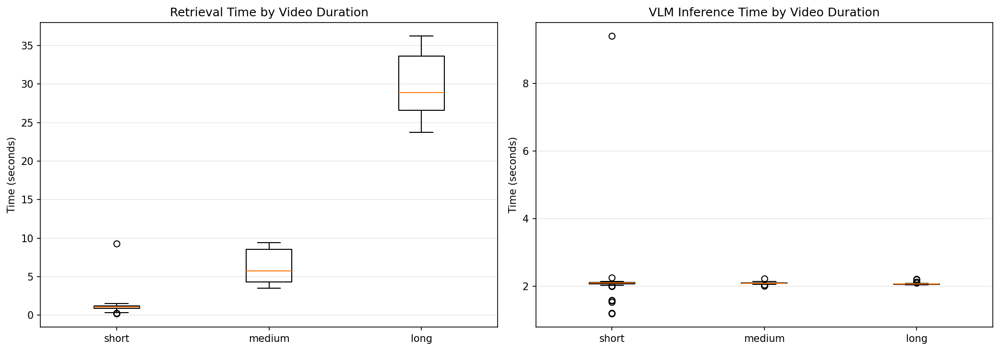

# VLM Context Engineering

## Project Overview

We're building on the AVAS (Agentic Video Analytics System) paper to perform a fine grained evaluation of how improvements in context management impact VLM accuracy, latency, and cost. Starting with a simple vector-RAG baseline, we progressively add: semantic chunking, event knowledge graphs, tri-view retrieval, agentic search, and self-consistency.

**Research Question**: How does the amount and structure of retrieved context change a VLM's accuracy, latency, and cost on video QA?

## Level 1 Baseline Results

| Metric | Value |
|--------|-------|
| Overall Accuracy | 52.0% |
| Total Questions | 150 |
| Avg Retrieval Time | 8.89s |
| Avg Inference Time | 2.11s |
| Short Video Accuracy | 56.7% |
| Medium Video Accuracy | 51.7% |
| Long Video Accuracy | 43.3% |





## Level 2 Semantic RAG Results

### Accuracy by Video Duration
| Duration | Level 1 (Baseline) | Level 2 (Semantic) | Improvement |
|----------|-------|-------|----------|
| Short Videos | 56.7% | 58.3% | +1.6% |
| Medium Videos | 51.7% | 58.3% | +6.6% |
| Long Videos | 43.3% | 40.0% | -3.3% |
| **Overall** | **52.0%** | **54.7%** | **+2.7%** |

### Top Task Type Results
| Task Type | Level 1 | Level 2 | Improvement |
|-----------|---------|---------|-------------|
| OCR Problems | 75.0% | 100.0% | +25.0% |
| Information Synopsis | 66.7% | 80.0% | +13.3% |
| Spatial Reasoning | 50.0% | 75.0% | +25.0% |
| Object Recognition | 60.9% | 65.2% | +4.3% |
| Action Reasoning | 50.0% | 57.1% | +7.1% |

## Current Status

### Completed
- Evaluation dataset: 50 videos (20 short, 20 medium, 10 long) from Video-MME
- Video download pipeline with caching
- **Level 1 Baseline RAG**: 
  - 1 FPS frame extraction
  - 3-frame chunking with middle-frame CLIP embeddings
  - Top-10 chunk retrieval via cosine similarity
  - Qwen2.5-VL-7B for answer generation
- **Level 2 Semantic RAG**: 
  - Semantic event detection using BERTScore (threshold=0.65)
  - Variable-length chunks with description generation (Qwen2.5-VL-2B)
  - 2.7% overall accuracy improvement, mixed results across video lengths
- Evaluation infrastructure with checkpointing and detailed metrics

### Infrastructure
- **Models**: Qwen2.5-VL-7B (VLM), OpenCLIP ViT-B-32 (embeddings)
- **Hardware**: GCP L4 GPU (24GB VRAM)
- **Dataset**: 50 videos (20 short/medium, 10 long), 150 questions across 12 task types from VideoMME

## Running Evaluations
```bash
# Level 1: Baseline evaluation
python eval.py --level baseline

# Level 2: Semantic RAG evaluation  
python eval.py --level semantic
```

## Notes

- All videos are 360p, video-only (no audio) for consistent preprocessing
- Using K=10 frames per question for Level 1
