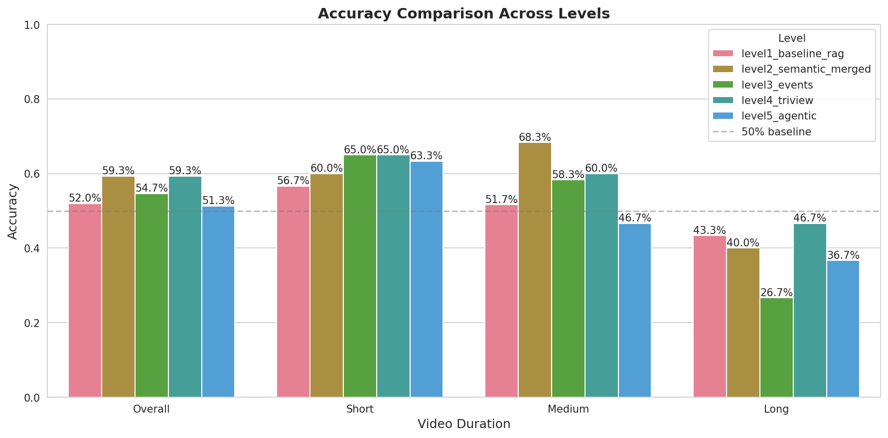
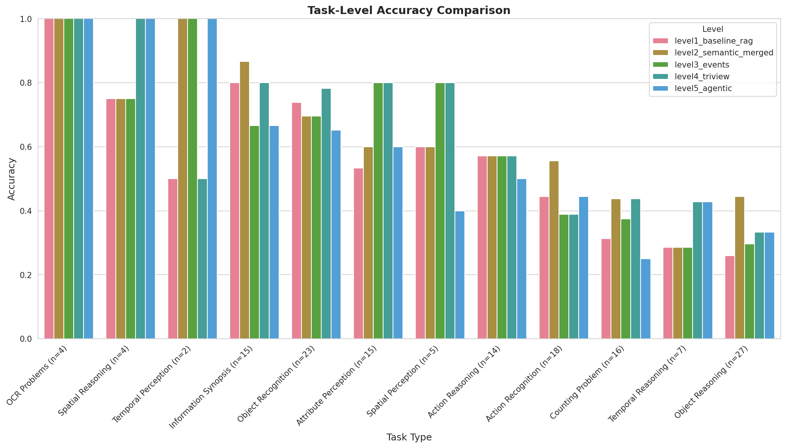
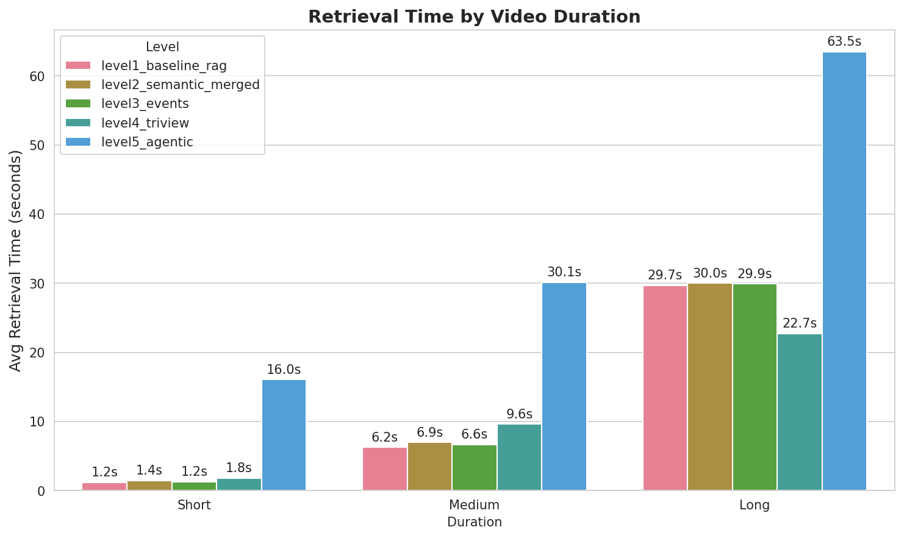
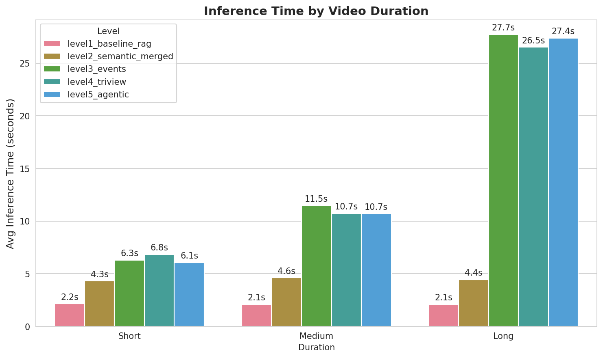
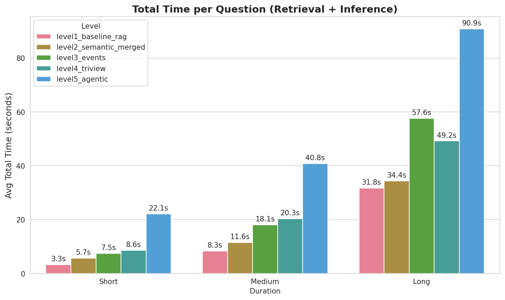
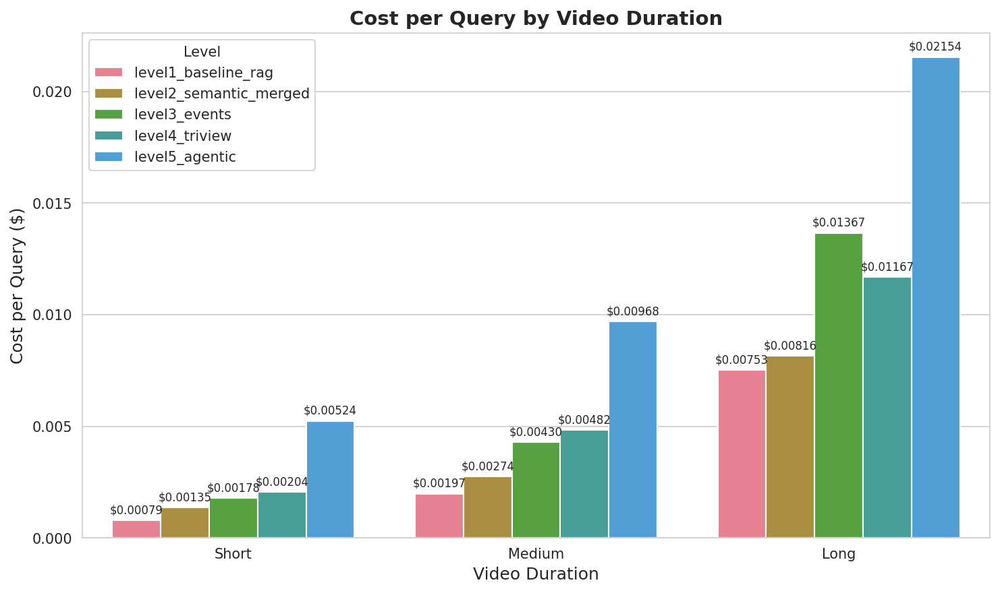

# VLM Context Engineering

## Project Overview

We're building on the [AVAS (Agentic Video Analytics System)](https://arxiv.org/abs/2505.00254) paper to perform a fine-grained evaluation of how improvements in context management impact VLM accuracy, latency, and cost. Starting with a simple vector-RAG baseline, we progressively add: semantic chunking, event knowledge graphs, tri-view retrieval, agentic search, and self-consistency.

**Research Question**: How does the amount and structure of retrieved context change a VLM's accuracy, latency, and cost on video QA?

## Results Summary

### Overall Performance Comparison

| Metric | L1 (Baseline) | L2 (Semantic) | L3 (Events) | L4 (Tri-view) | L5 (Agentic) | Best |
|--------|---------------|---------------|-------------|---------------|--------------|------|
| **Overall Accuracy** | 52.0% | 59.3% | 54.7% | 59.3% | 51.3% | **L2/L4: 59.3%** |
| **Total Time/Question** | 11.0s | 13.8s | 21.8s | 12.4s | 34.3s | **L1: 11.0s** |

*Includes preprocessing time (tri-view embedding generation)

### Accuracy by Video Duration

| Duration | L1 | L2 | L3 | L4 | L5 | Best |
|----------|----|----|----|----|-------|------|
| **Short Videos** (60 questions) | 56.7% | 60.0% | **65.0%** | **65.0%** | 63.3% | **L3/L4: 65.0%** |
| **Medium Videos** (60 questions) | 51.7% | **68.3%** | 58.3% | 60.0% | 46.7% | **L2: 68.3%** |
| **Long Videos** (30 questions) | 43.3% | 40.0% | 26.7% | **46.7%** | 36.7% | **L4: 46.7%** |

**Key Findings**:
- **L3 (Events)**: Strong on short videos (+5% over L2) but degrades on longer content (-10% medium, -13.3% long). Event graphs help with focused content but struggle as event count grows.
- **L4 (Tri-view)**: Best overall balance - matches L2's accuracy with similar latency, and improves long video performance (+6.7% over L2). Multi-modal retrieval (visual + semantic + entity) provides robustness.
- **L5 (Agentic)**: Worst performance despite 3x higher latency. Visual navigation adds overhead without accuracy gains, suggesting agent needs better guidance or more sophisticated search strategies.

### Cost Analysis

**Cost per Query by Duration** ($0.000237 per second):

| Level | Short | Medium | Long | Weighted Avg* |
|-------|-------|--------|------|---------------|
| L1 (Baseline) | $0.00246 | $0.00255 | $0.00282 | $0.00257 |
| L2 (Semantic) | $0.00301 | $0.00344 | $0.00341 | $0.00324 |
| L3 (Events) | $0.00480 | $0.00524 | $0.00547 | $0.00507 |
| L4 (Tri-view) | $0.00302 | $0.00541 | $0.01019 | $0.00522 |
| L5 (Agentic) | $0.00778 | $0.00844 | $0.00892 | $0.00824 |

*Weighted by question distribution: 40% short, 40% medium, 20% long

### Visualizations








## Architecture Details

### Level 1: Baseline RAG
- **Chunking**: Fixed 3-second chunks at 1 FPS (3 frames/chunk)
- **Embedding**: Middle frame only with OpenCLIP ViT-B-32
- **Retrieval**: Top-10 chunks via cosine similarity
- **Context**: 10 middle frames (one per chunk) + question
- **VLM**: Qwen2.5-VL-7B for answer generation

### Level 2: Semantic RAG with Merged Chunks
- **Chunking**: Semantic event detection using BERTScore (threshold=0.7)
  - Base chunks: 5 seconds at 1 FPS
  - Merging: Adjacent chunks merged if description similarity > 0.7
  - Length caps: 30s (short/medium), 60s (long videos)
- **Description**: Qwen2.5-VL-2B generates merged descriptions for each chunk
- **Embedding**: 5-frame average per chunk (evenly sampled) with OpenCLIP
- **Retrieval**: Top-10 chunks via cosine similarity
- **Context**: 
  - Text descriptions + sampled frames from selected chunks
  - Frame budget: 25 frames distributed proportionally by similarity
- **VLM**: Qwen2.5-VL-7B for answer generation

### Level 3: Event Knowledge Graphs (EKG)
- **Event Creation**: Adjacent chunks merged if similarity > 0.75
  - Average: 6.2 events per video
- **Entity Extraction**: Qwen3-4B extracts entities (objects, actions, locations, attributes)
- **Entity Linking**: Embedding-based deduplication (threshold=0.85)
  - Links mentions of same entities across events
- **Graph Construction**: 
  - NEXT relationships (temporal sequence)
  - APPEARS_IN relationships (entity→event)
  - CO_OCCURS relationships (entity→entity, frequency ≥3, top 15 per event)
- **Retrieval**: Dual-mode similarity
  - CLIP embeddings (10 frames/event): 60% weight
  - Text description similarity: 40% weight
  - Top-k events selected (k=10)
- **Context**:
  - Events sorted chronologically
  - Temporal header: "Events in chronological order"
  - Event descriptions with timestamps: "Event 1 (0.0s - 5.0s): description"
  - Frame budget: 30 frames allocated proportionally across events
- **VLM**: Qwen2.5-VL-7B for answer generation

### Level 4: Tri-View Retrieval
- **Event Base**: Uses L3's event knowledge graphs
- **Multi-Modal Embeddings**: Pre-computed for each event:
  - **Visual**: 5-frame average CLIP embeddings (OpenCLIP ViT-B-32)
  - **Semantic**: Text description embeddings (sentence-transformers all-MiniLM-L6-v2)
  - **Entity**: Entity name embeddings (sentence-transformers all-MiniLM-L6-v2)
- **Retrieval Strategy**: Reciprocal Rank Fusion (RRF)
  - Compute separate rankings from visual, semantic, and entity similarities
  - Combine using RRF: `score = 1/(k + rank_visual) + 1/(k + rank_semantic) + 1/(k + rank_entity)`
  - k=30
  - Top-5 events selected by fused score
- **Context**: Same as L3 (chronologically ordered events with timestamps)
- **VLM**: Qwen2.5-VL-7B for answer generation
- **Preprocessing**: ~1.8s (short), ~9.6s (medium), ~22.7s (long) to build tri-view cache

### Level 5: Agentic Visual Navigation
- **Agent Model**: Qwen3-VL-2B for navigation decisions
- **Event Base**: Uses L4's tri-view event retrieval for initial event
- **Navigation Strategy**:
  - Agent starts at top RRF-retrieved event
  - Views 5 sampled frames from current event
  - Sees own exploration history (previous decisions + reasoning)
  - Decides: NEXT (move forward), PREVIOUS (move back), or ANSWER (stop)
  - Max 5 hops to explore temporal neighborhood
- **Context Building**:
  - Visited events collected during navigation
  - Frame budget: 25 frames distributed across visited events
  - Event descriptions + frames passed to VLM
- **VLM**: Qwen2.5-VL-7B for final answer generation

**Performance Issues:**
- **Worst accuracy** (51.3%, -8% vs L4) despite 3x higher latency
- Exploration strategy needs improvement:
  - Likely need larger model for better navigation logic
  - Richer context in navigation prompt
  - Possibly add option to jump around video of highest ranked event actually irrelevant

## Current Status

### Completed
- Evaluation dataset: 50 videos (20 short, 20 medium, 10 long) from Video-MME
- Video download pipeline with caching
- **Level 1 Baseline RAG**: Fixed 3-second chunks, middle-frame embeddings, top-10 retrieval
- **Level 2 Semantic RAG**: Semantic merging, multi-frame embeddings, adaptive selection
- **Level 3 Event Knowledge Graphs**: Entity extraction, graph construction, temporal retrieval
- **Level 4 Tri-View Retrieval**: Multi-modal embeddings (visual + semantic + entity) with RRF fusion
- **Level 5 Agentic Navigation**: Visual agent explores event graphs with self-reflective reasoning
- Comprehensive evaluation infrastructure with detailed metrics and visualizations
- Analysis notebooks for cross-level comparison

### Infrastructure
- **Models**: 
  - VLM: Qwen2.5-VL-7B (answer generation)
  - Description: Qwen2.5-VL-2B (chunk descriptions, L2+)
  - Entity Extraction: Qwen3-4B (L3+)
  - Agent: Qwen3-VL-2B (L5 navigation)
  - Embeddings: OpenCLIP ViT-B-32 (visual), sentence-transformers all-MiniLM-L6-v2 (text/entities)
- **Hardware**: GCP L4 GPU (24GB VRAM)
- **Dataset**: 50 videos (20 short, 20 medium, 10 long), 150 questions across 12 task types from VideoMME

## Running Evaluations

```bash
# Level 1: Baseline evaluation
python eval.py --level baseline

# Level 2: Semantic RAG evaluation  
python eval.py --level semantic

# Level 3: Event Knowledge Graph evaluation
python eval.py --level events

# Level 4: Tri-view retrieval evaluation
python eval.py --level triview

# Level 5: Agentic navigation evaluation
python eval.py --level agentic
```

## Notes

- All videos are 360p, video-only (no audio)
- Semantic chunking uses BERTScore threshold of 0.7 for merging decisions
- Frame budget of 25 per question is distributed across selected chunks
- Evaluation uses greedy decoding (temperature=0) for reproducibility
- Level 2+ chunk descriptions generated offline at 1.36 FPS. (~6 FPS in AVAS with 2 A100's)
- Level 3+ event/entity extraction adds ~50s preprocessing per video
- Level 4+ tri-view embedding generation adds 1.8-22.7s preprocessing per video
- Cost calculations based on L4 GPU pricing: $0.000237 per second
