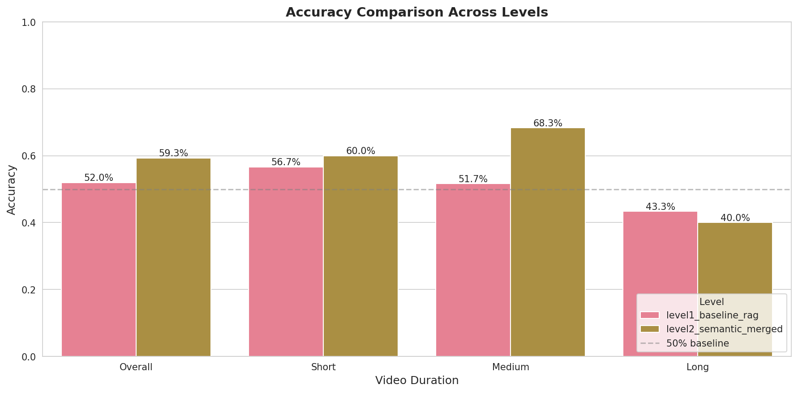
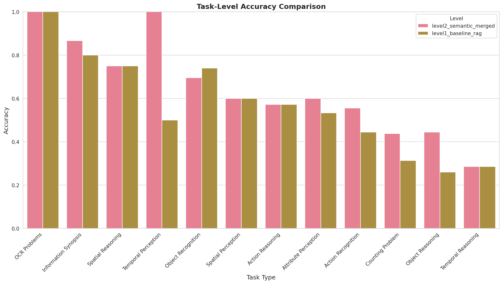
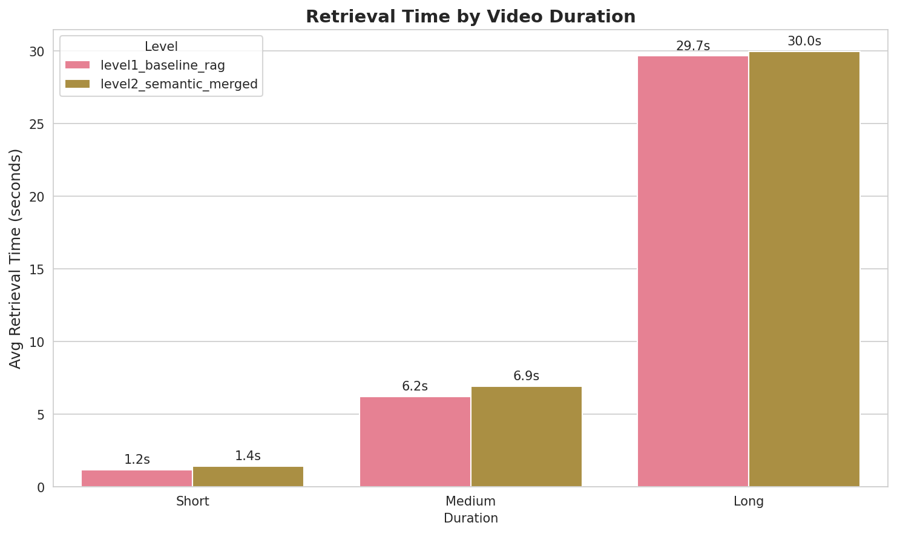

# VLM Context Engineering

## Project Overview

We're building on the [AVAS (Agentic Video Analytics System)](https://arxiv.org/abs/2505.00254) paper to perform a fine-grained evaluation of how improvements in context management impact VLM accuracy, latency, and cost. Starting with a simple vector-RAG baseline, we progressively add: semantic chunking, event knowledge graphs, tri-view retrieval, agentic search, and self-consistency.

**Research Question**: How does the amount and structure of retrieved context change a VLM's accuracy, latency, and cost on video QA?

## Results Summary

### Overall Performance Comparison

| Metric | Level 1 (Baseline) | Level 2 (Semantic) | Level 3 (Events) | Δ L2→L3 |
|--------|-------|-------|-------|------|
| **Overall Accuracy** | 52.0% | 59.3% | **54.7%** | **-4.6%** |
| Avg Retrieval Time | 8.89s | 9.34s | 9.13s | -0.21s |
| Avg Inference Time | 2.11s | 4.45s | 12.65s | +8.20s |
| **Total Time/Question** | 11.0s | 13.8s | 21.8s | +8.0s |

### Accuracy by Video Duration

| Duration | Level 1 | Level 2 | Level 3 | Δ L2→L3 |
|----------|---------|---------|---------|---------|
| Short Videos (60 questions) | 56.7% | 60.0% | **65.0%** | **+5.0%** |
| Medium Videos (60 questions) | 51.7% | 68.3% | **58.3%** | **-10.0%** |
| Long Videos (30 questions) | 43.3% | 40.0% | **26.7%** | **-13.3%** |

**Key Finding**: Event-based retrieval shows **strong improvements on short videos** (+5.0%), but **significant degradation on medium and long videos** (-10.0% and -13.3%). This suggests:
- Event knowledge graphs help with focused, short-form content
- Long videos create many events, making retrieval challenging
- More careful retreival/graph traversal is required for increasingly long videos




### Latency Analysis




## Architecture Details

### Level 1: Baseline RAG
- **Chunking**: Fixed 3-second chunks at 1 FPS (3 frames/chunk)
- **Embedding**: Middle frame only with OpenCLIP ViT-B-32
- **Retrieval**: Top-10 chunks via cosine similarity
- **Context**: 10 middle frames (one per chunk) + question
- **VLM**: Qwen2.5-VL-7B for answer generation

### Level 2: Semantic RAG with Merged Chunks
- **Chunking**: Semantic event detection using BERTScore (threshold=0.7)
  - Base chunks: 5 seconds at 1 FPS
  - Merging: Adjacent chunks merged if description similarity > 0.7
  - Length caps: 30s (short/medium), 60s (long videos)
- **Description**: Qwen2.5-VL-2B generates merged descriptions for each chunk
- **Embedding**: 5-frame average per chunk (evenly sampled) with OpenCLIP
- **Retrieval**: Top-10 chunks via cosine similarity
- **Context**: 
  - Text descriptions + sampled frames from selected chunks
  - Frame budget: 25 frames distributed proportionally by similarity
- **VLM**: Qwen2.5-VL-7B for answer generation

### Level 3: Event Knowledge Graphs (EKG)
- **Event Creation**: Adjacent chunks merged if similarity > 0.75
  - Average: 6.2 events per video
- **Entity Extraction**: Qwen3-4B extracts entities (objects, actions, locations, attributes)
- **Entity Linking**: Embedding-based deduplication (threshold=0.85)
  - Links mentions of same entities across events
- **Graph Construction**: 
  - NEXT relationships (temporal sequence)
  - APPEARS_IN relationships (entity→event)
  - CO_OCCURS relationships (entity→entity, frequency ≥3, top 15 per event)
- **Retrieval**: Dual-mode similarity
  - CLIP embeddings (10 frames/event): 60% weight
  - Text description similarity: 40% weight
  - Top-k events selected (k=10)
- **Context**:
  - Events sorted chronologically
  - Temporal header: "Events in chronological order"
  - Event descriptions with timestamps: "Event 1 (0.0s - 5.0s): description"
  - Frame budget: 30 frames allocated proportionally across events
- **VLM**: Qwen2.5-VL-7B for answer generation

## Current Status

### Completed
- Evaluation dataset: 50 videos (20 short, 20 medium, 10 long) from Video-MME
- Video download pipeline with caching
- **Level 1 Baseline RAG**: Fixed 3-second chunks, middle-frame embeddings, top-10 retrieval
- **Level 2 Semantic RAG**: Semantic merging, multi-frame embeddings, adaptive selection
- **Level 3 Event Knowledge Graphs**: Entity extraction, graph construction, temporal retrieval
- Comprehensive evaluation infrastructure with detailed metrics and visualizations
- Analysis notebooks for cross-level comparison

### Next Steps
- Level 4: Tri-view retrieval
- Level 5: Agentic search
- Level 6: Self-consistency

### Infrastructure
- **Models**: 
  - VLM: Qwen2.5-VL-7B (answer generation)
  - Description: Qwen2.5-VL-2B (chunk descriptions, Level 2+)
  - Embeddings: OpenCLIP ViT-B-32
- **Hardware**: GCP L4 GPU (24GB VRAM)
- **Dataset**: 50 videos (20 short, 20 medium, 10 long), 150 questions across 12 task types from VideoMME

## Running Evaluations

```bash
# Level 1: Baseline evaluation
python eval.py --level baseline

# Level 2: Semantic RAG evaluation  
python eval.py --level semantic

# Level 3: Event Knowledge Graph evaluation
python eval.py --level event
```

## Notes

- All videos are 360p, video-only (no audio)
- Semantic chunking uses BERTScore threshold of 0.7 for merging decisions
- Frame budget of 25 per question is distributed across selected chunks
- Evaluation uses greedy decoding (temperature=0) for reproducibility
- Level 2+ chunk descriptions generated offline at 1.36 FPS. (~6 FPS in AVAS with 2 A100's)
- Level 3+ event/entity extraction adds ~50s preprocessing per video
