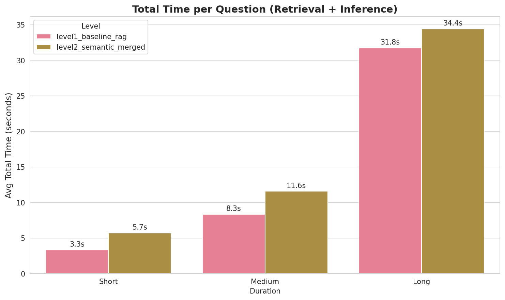

# VLM Context Engineering

## Project Overview

We're building on the [AVAS (Agentic Video Analytics System)](https://arxiv.org/abs/2505.00254) paper to perform a fine-grained evaluation of how improvements in context management impact VLM accuracy, latency, and cost. Starting with a simple vector-RAG baseline, we progressively add: semantic chunking, event knowledge graphs, tri-view retrieval, agentic search, and self-consistency.

**Research Question**: How does the amount and structure of retrieved context change a VLM's accuracy, latency, and cost on video QA?

## Results Summary

### Overall Performance Comparison

| Metric | Level 1 (Baseline) | Level 2 (Semantic) | Δ |
|--------|-------|-------|------|
| **Overall Accuracy** | 52.0% | 59.3% | **+7.3%** |
| Avg Retrieval Time | 8.89s | 9.34s | +0.45s |
| Avg Inference Time | 2.11s | 4.45s | +2.34s |
| **Total Time/Question** | 11.0s | 13.8s | +2.8s |

### Accuracy by Video Duration

| Duration | Level 1 | Level 2 | Δ |
|----------|---------|---------|---|
| Short Videos (60 questions) | 56.7% | 60.0% | +3.3% |
| Medium Videos (60 questions) | 51.7% | 68.3% | **+16.6%** |
| Long Videos (30 questions) | 43.3% | 40.0% | -3.3% |

**Key Finding**: Semantic chunking shows **dramatic improvements on medium-length videos** (+16.6%), modest gains on short videos (+3.3%), but slight degradation on long videos (-3.3%). This suggests that adaptive chunking works best when there's enough content to merge semantically, but struggles with very long videos where retrieval becomes challenging.

### Task Type Performance

**Biggest Improvements:**
- **Information Synopsis**: 80.0% → 86.7% (+6.7%)
- **Action Recognition**: 44.4% → 55.6% (+11.1%)

**Areas of Concern:**
- **Object Reasoning**: 25.9% → 44.4% (+18.5%) - still low absolute performance
- **Temporal Reasoning**: Still at 28.6% - both approaches struggle with temporal understanding
- **Counting Problems**: 31.3% → 43.8% (+12.5%) - improvement but still challenging


### Latency Analysis




## Architecture Details

### Level 1: Baseline RAG
- **Chunking**: Fixed 3-second chunks at 1 FPS (3 frames/chunk)
- **Embedding**: Middle frame only with OpenCLIP ViT-B-32
- **Retrieval**: Top-10 chunks via cosine similarity
- **Context**: 10 middle frames (one per chunk) + question
- **VLM**: Qwen2.5-VL-7B for answer generation

### Level 2: Semantic RAG with Merged Chunks
- **Chunking**: Semantic event detection using BERTScore (threshold=0.7)
  - Base chunks: 5 seconds at 1 FPS
  - Merging: Adjacent chunks merged if description similarity > 0.7
  - Length caps: 30s (short/medium), 60s (long videos)
- **Description**: Qwen2.5-VL-2B generates merged descriptions for each chunk
- **Embedding**: 5-frame average per chunk (evenly sampled) with OpenCLIP
- **Retrieval**: Top-10 chunks via cosine similarity
- **Context**: 
  - Text descriptions + sampled frames from selected chunks
  - Frame budget: 25 frames distributed proportionally by similarity
- **VLM**: Qwen2.5-VL-7B for answer generation

**Key Differences from Baseline:**
- Variable-length semantic chunks vs fixed 3-second chunks
- Multi-frame embedding (5-frame average) vs single middle frame
- Text descriptions included in VLM prompt
- Adaptive chunk selection vs fixed top-10

## Current Status

### Completed
- Evaluation dataset: 50 videos (20 short, 20 medium, 10 long) from Video-MME
- Video download pipeline with caching
- **Level 1 Baseline RAG**: Fixed 3-second chunks, middle-frame embeddings, top-10 retrieval
- **Level 2 Semantic RAG**: Semantic merging, multi-frame embeddings, adaptive selection
- Comprehensive evaluation infrastructure with detailed metrics and visualizations
- Analysis notebooks for cross-level comparison

### Next Steps
- Level 3: Event Knowledge Graphs for improved temporal reasoning
- Level 4: Tri-view retrieval
- Level 5: Agentic search
- Level 6: Self-consistency

### Infrastructure
- **Models**: 
  - VLM: Qwen2.5-VL-7B (answer generation)
  - Description: Qwen2.5-VL-2B (chunk descriptions, Level 2+)
  - Embeddings: OpenCLIP ViT-B-32
- **Hardware**: GCP L4 GPU (24GB VRAM)
- **Dataset**: 50 videos (20 short, 20 medium, 10 long), 150 questions across 12 task types from VideoMME

## Running Evaluations

```bash
# Level 1: Baseline evaluation
python eval.py --level baseline

# Level 2: Semantic RAG evaluation  
python eval.py --level semantic
```

## Notes

- All videos are 360p, video-only (no audio)
- Semantic chunking uses BERTScore threshold of 0.7 for merging decisions
- Frame budget of 25 per question is distributed across selected chunks
- Evaluation uses greedy decoding (temperature=0) for reproducibility
- Level 2+ chunk descriptions generated offline at 1.36 FPS. (~6 FPS in avas with 2 A100's)